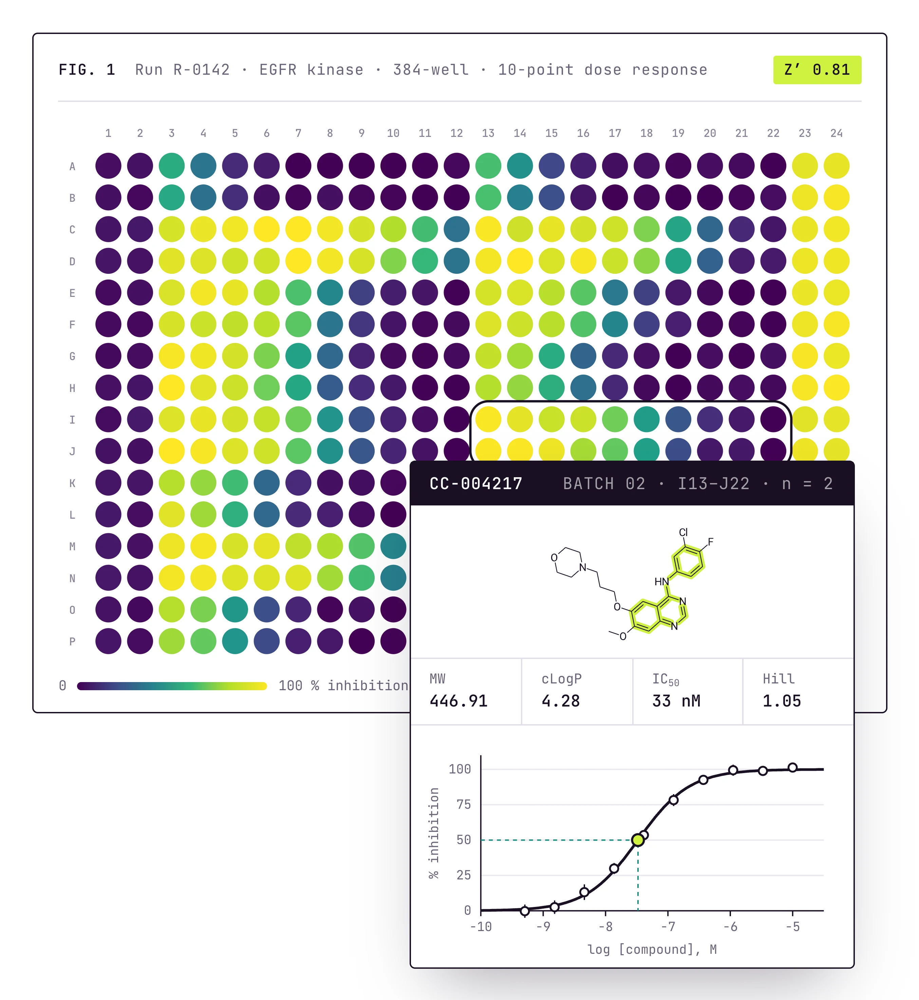
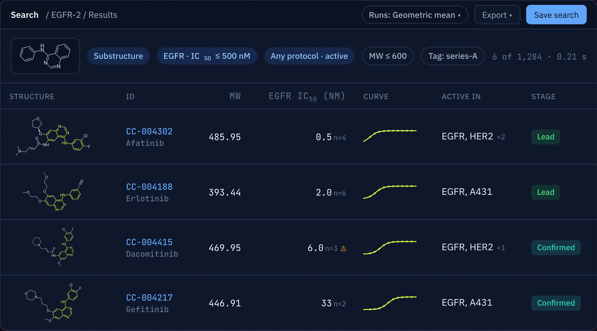
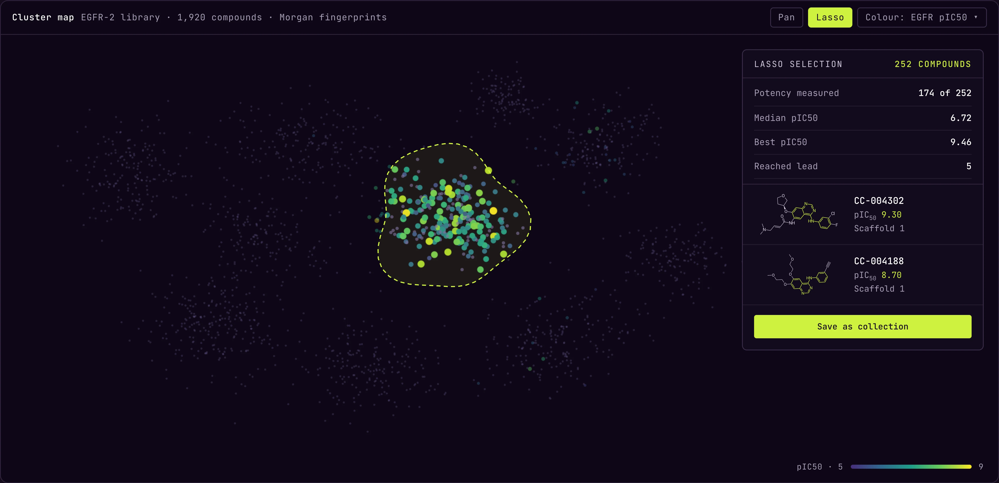
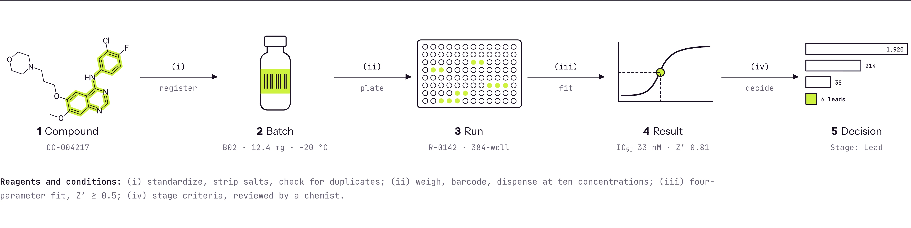
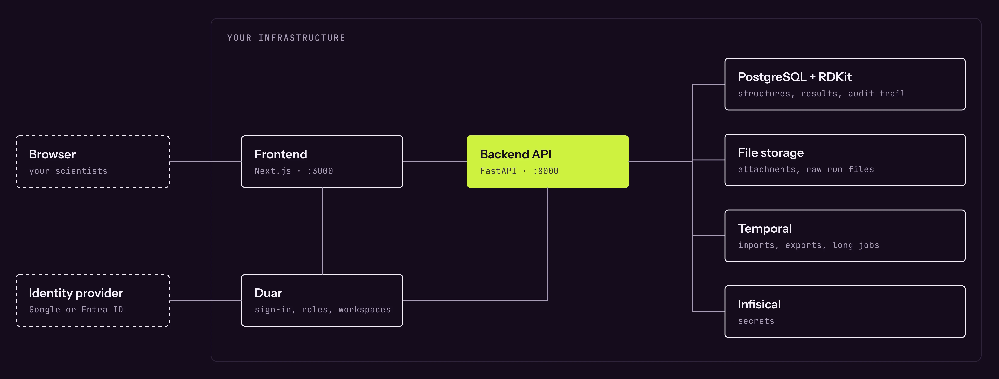

<p align="center">
  <picture>
    <source media="(prefers-color-scheme: dark)" srcset=".github/readme/hex-lens-dark.svg">
    
  </picture>
</p>

<h1 align="center">ChemCellar</h1>

<p align="center">Open-source, self-hosted compound registration, management and screening app.</p>

<p align="center">
  
</p>

ChemCellar registers compounds, runs screens and records what to make next. The structure you register is the same record your assay results, SAR tables and freezer locations point to, so nothing is copied between systems and nothing drifts. It runs on your own hardware, behind your own identity provider.

## What it does

**Registration.** Structures go through the ChEMBL structure pipeline: salts are stripped and recorded on the batch, charges neutralized, the parent extracted. Duplicates are matched on InChIKey, so enantiomers stay distinct and a matching structure joins the compound it matches. Bulk import takes SDF, CSV or Excel, with a preview before anything is written.

**Search.** Substructure and similarity search run in PostgreSQL through the RDKit cartridge; exact match is by InChIKey. Combine a structure with assay criteria across any protocol, properties, tags and projects in one query. Choose how runs combine (latest run, geometric mean, arithmetic mean, best fit), and runs that disagree by more than tenfold are flagged. Searches can be saved and shared; results export to CSV, SDF, Excel or a PDF report.

<p align="center">
  
</p>

**Protocols.** An assay catalog with facets for target, format, detection, organism and status. When a new protocol resembles an existing one you are shown it and you decide; nothing is blocked. Readouts and conditions are versioned with the protocol.

**Screening.** Import runs from plate files or summary tables; the original file is kept with the run. Z′ is computed from the controls on every plate. Fit curves, exclude points with a reason, and keep the history of edits. Hit criteria record who set them and when, and freeze when the run is locked.

**SAR workbench.** A scaffold tree, an R-group table, and a cluster map on Morgan fingerprints with a lasso: draw around a region of chemical space and save it as a collection.

<p align="center">
  
</p>

**Campaigns.** Define the stages and the criteria that move a compound forward. Promote or demote with a reason; every override is attributed. A value reported as "> 10 µM" cannot prove a criterion, so it does not pass it. Campaign results are published to DAIKON.

**Inventory.** Freezer, rack, box, position. Loans, shipments and synthesis requests, each followed through to a new batch. A kiosk mode with barcode scanning for check-out and check-in.

**The record.** Every change lands in an append-only audit trail, enforced in the database. A result reported as ">" or "<" keeps that sign through every table, criterion and export.

<p align="center">
  
</p>

## Architecture

<p align="center">
  
</p>

- **Backend**: Python 3.13, FastAPI, SQLAlchemy (async), PostgreSQL 16 with the RDKit cartridge; Temporal for imports, exports and long jobs; Infisical for secrets.
- **Frontend**: Next.js 16, React 19, TypeScript; Ketcher for drawing structures, RDKit.js, Plotly.
- **Sign-in**: [Duar](https://github.com/sidxz/duar), a separate open-source service, with Google or Microsoft Entra ID as the identity provider.

Everything inside the boundary runs on your hardware. Nothing reports back to us.

## Self-hosting

You bring Docker with Compose, a running [Duar](https://github.com/sidxz/duar), and an identity provider.

```bash
git clone https://github.com/sidxz/cellar
cd cellar && cp .env.example .env   # set Duar, your identity provider, the database credentials and CELLAR_TAG
make prod-up                        # pulls the published images, runs the migrations, starts the stack
```

The app is at http://localhost:3000 and the API at http://localhost:8000. The images are published to GHCR as `ghcr.io/sidxz/cellar-backend` and `ghcr.io/sidxz/cellar-frontend`; `CELLAR_TAG` selects the release to run.

Your data stays portable: `make export-data` writes the database and every file to a bundle, and `make import-data` restores it on another machine. See [REPLICATION.md](REPLICATION.md).

## Development

```bash
make up                 # Postgres + RDKit, Valkey, Infisical and Temporal in containers, then migrations
make dev                # backend, worker and frontend
make import-demo-data   # demo data
make test
```

Python is managed with `uv`, JavaScript with `pnpm`. The domain model, conventions and decisions are under [docs/](docs/).

## Related

ChemCellar is one of a family: [DocuStore](https://docustore.io) extracts compounds and bioactivity from documents, and DAIKON tracks discovery projects and pipelines.

## License

ChemCellar is released under the [GNU Affero General Public License v3.0](LICENSE).
